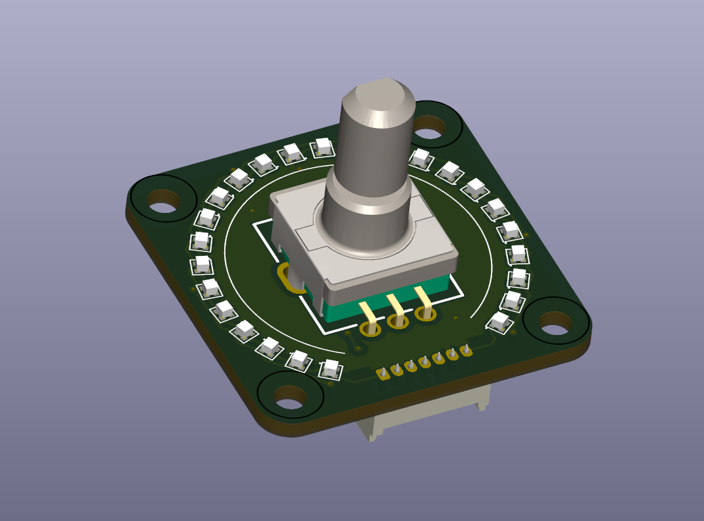
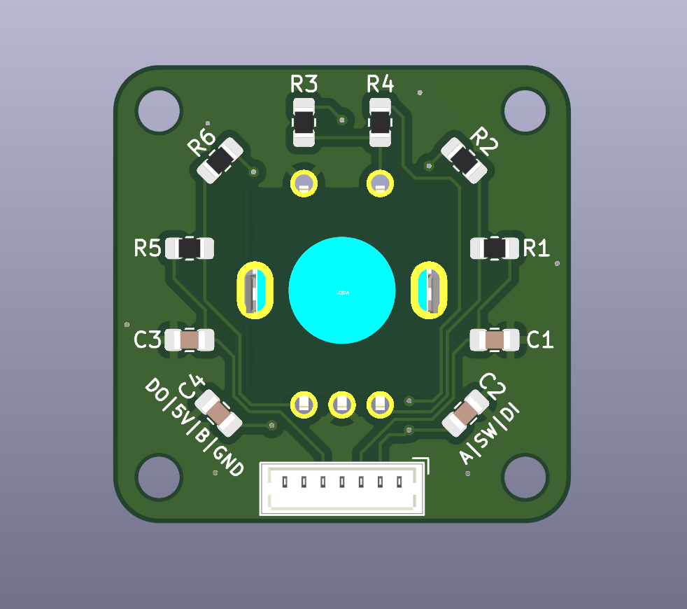
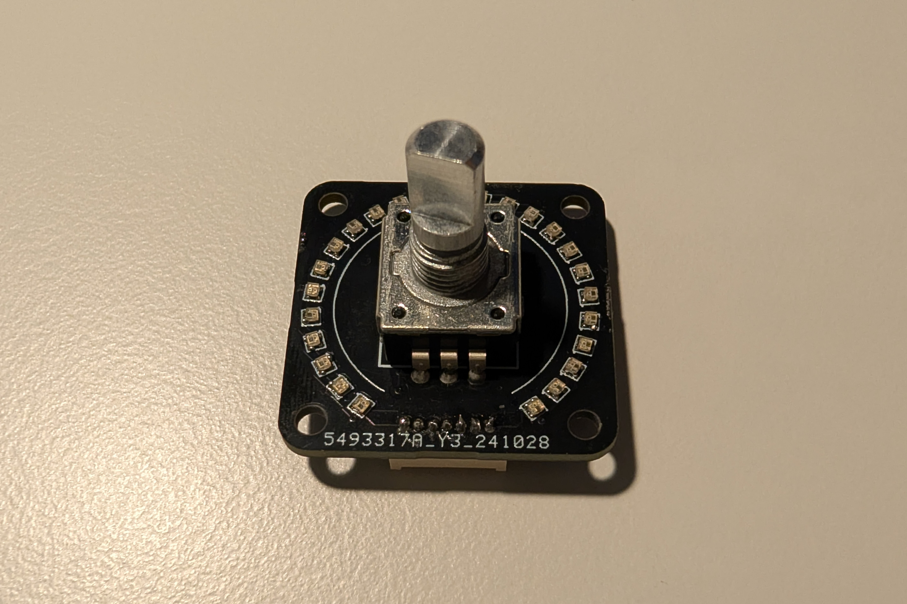
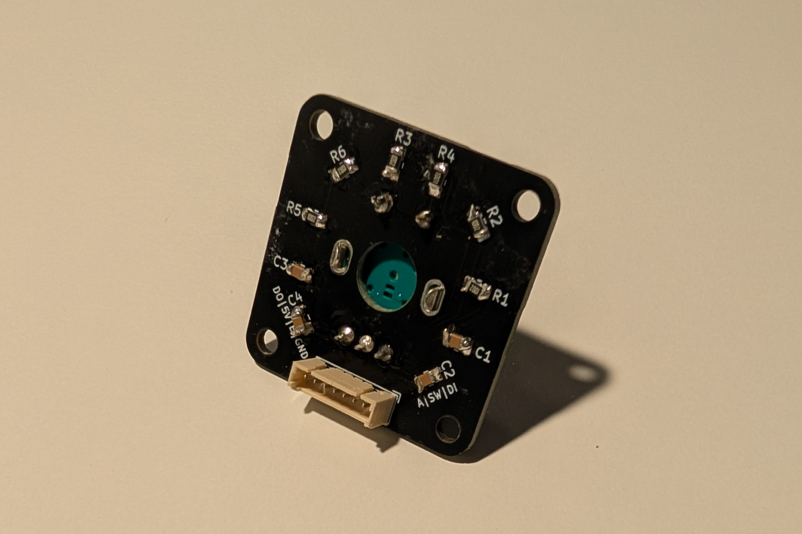
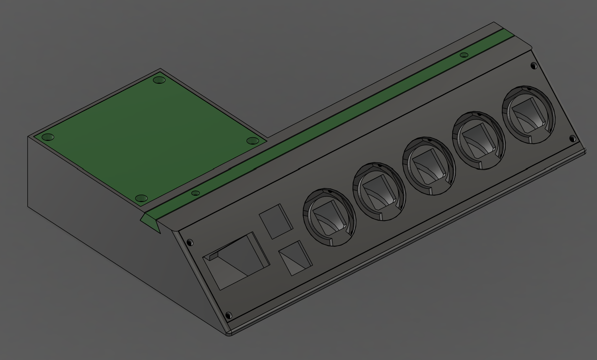

# SoundMixer
A deej-powered Soundmixer for individual volume control with rotary encoders, leds, buttons and oled support. I've also made an enclosure that is supposed to be mounted below a table.

This is still an early version and rebuilding your own might become very tricky. I am actively working on a second version that will be easier to build and assemble.

# Hardware
The soundmixer uses the following things:
- Arduino nano
- 5x Custom PCBs with 25 ws2812 LEDs and rotary encoder
- 1x 1.3" i2c oled screen (ssd1306)
- 2x mx-switch
- 2x pull-up resistors
- A lot of cables

### LED-PCB
For the LEDs i've designed a custom pcb with a size of 3x3cm. On the front side are 25 1010 ws2812 LEDs, neatly arranged around a rotary encoder (PEC11R-4015F-S0024). The backside features some capacitors and resistors used mainly for the encoder. It also features a small 7-pin molex picoblade connector due to the limited space.

The pcb was designed in kicad. I am still working on a version2 that features two pcbs stacked on top of each other, so the encoder does not stick out too far above the leds.

I will upload the files once i think that i'm happy with the pcb. Let me know if you would be interested in this or the following version

### Enclosure
The entire enclosure is 3d-printed, mainly in PLA. The diffusers in front of the led rings are made out of translucent PETG.
The parts are screwed together with some M2.5 screws. 

# Software

### PC Side
On the pc side, it uses a fork of the original deej project [found here](https://github.com/michaelwschultz/deej). 

### Arduino Side
For the arduino i wrote my own firmware (see the [software](Software) folder), with the help of platformio using some arduino libraries.
